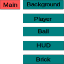

# Breakout Game

## General Data
- Author: Juan Cru
- Mail: juanbcru@hotmail.com
- Start Date: 2023-10-21
- Last update: 2023-10-25
- Platform: Android
- Resolution: 480x720
- Engine: Godot with GDScript
## Introducction
This project is a breakout type game. It consist in 10 simple levels where the player must break the tiles on the upper part of the screen.
## General mechanics
- One player
- Player is a horizontal stick that try to catch a ball
- The ball bounces and brake a brick if exists collision
- Brick dissapear when is touched by a ball
- The level finish when every brick has disappeared
- There are 5 leves with many bricks distributed by the upper part of the scenario
- Score: the less It is measured by time. The less time the better.
- 3 lifes. The game finish when the lives are gone or the player finish the 5 levels.
- Only register score when the levels are finished.
## Things I should take into account
- How design ir order to add more features in the future **(IMPORTANT)**:
	- Dropping boosters or limiters
	- Letting transform player **(ANIMATIONS)**
	- Multiball
	- etc
- How distribute the tiles in every scenerio
	- As first idea I've thougth in a matrix that will let instantiate the tiles under a determinated parameters: type, color, etc
		- I could create a method that generate it
	- It could be at random too, but it doesn't permits a progressive difficulty	 
## Planning
- Design a draft with the game components 
- Create assests
	- Player asset
	- Brick asset
		- Can I modify color, shape, etc., from the code?
	- Ball asset
	- Backgrounds
- Create componentes
## Game main components

## Development
### 2023-10-25
- **The next time I have to documentate every step and decisions**
- I've constructed a **Main scene** that contain the next scenes:
	- **Background**: after doing several tests I finally decided use a Sprite2D to represent a black background. In the future is needed **more research**. From here I instantiate the **scene Star** with the method spawn_stars(), and the scene **Ball** which movement is control by itself.
	- **Player**: the best node that fit the player was AnimatableBody2D. It interact with the phisic engine and I can control the position. Furthermore it detect the collisions.
	- **BrickDistribution**: a Node2D node with the only pourpose of contain an script that controls the configuration of the bricks on the screen for every level. I've used a kind of matrix that contain 10 strings with 7 binary characters each. The bricks color change every new line. From here I can instantiate the scene **Brik** an change properties like position and color. The Brick scene contain an AnimatedSprite2D that make an animation on collision with the ball.
- I've been practicing with different collision nodes selecting the ones that fitted my necesities, but here **I need deppen on the topic** ([https://docs.godotengine.org/en/stable/tutorials/physics/index.html](https://docs.godotengine.org/en/stable/tutorials/physics/index.html "Phisics documentation in Godot web")).
- It's important the next time I **organize the files in different directories** from the start.
- I haven't design with **scalability in mind** --> error.
- Animations: I've discovered the node Tween
- I've used Inkscape svg editor to create the assets. 